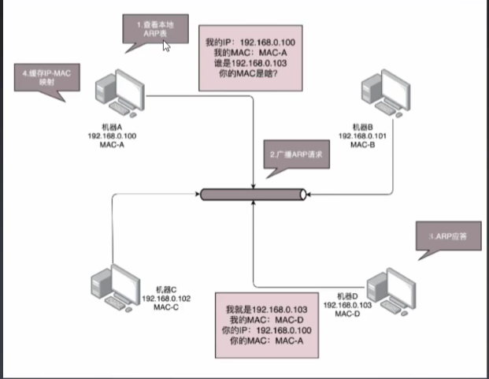
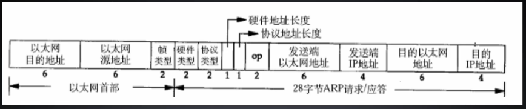

# IP层

当电脑之间进行连接，还需要配置这两台电脑的IP地址、子网掩码和默认网关

要想终端之间能够通信，这三项必须配置成一个网络下的不同主机，例如：一个是192.168.0.1/24，另一个是192.168.0.2/24，否则无法联通

还有一个问题没有解决：当源机器直到目标机器的时候，可以将目标地址放入包里面，如果不知道呢？一个局域网里面接入了N台机器，怎么直到每个MAC地址都是谁呢？

# 网络层 ARP协议

ARP协议的目的是在已知IP地址时，求MAC地址的协议

## ARP表

计算机会记录曾经和它沟通过的在某个IP下的MAC地址，即IP - MAC映射关系表

## ARP数据包格式

为了避免每次都用ARP请求，机器本地也会进行ARP缓存。同时机器会不断地上下线，IP也可能会变化，所以ARP的MAC地址缓存过一段时间就会过期

- op：报文模式
  - 1 - request 
  - 2 - reply

# 交换机

集线器的组网方式会产生大量的脏数据，当数据量较大时冲突的概率就会提高

这是需要一个智能设备，因为每个口都只连接一台电脑，这台电脑不怎么更换IP和MAC地址，只要记住这台电脑的MAC地址，如果目标MAC地址不是这台电脑的，这个口就不用转发

## 交换机获取接口的MAC地址

这需要交换机学习，例如一条MAC1电脑将一个包发送给另一台MAC2电脑，当这个包到达交换机的时候，一开始交换机也不知道MAC2的电脑在哪个口，所以它只能将包发给除了源口之外的所有口，此时交换机

会记住MAC1来自一个明确的口，以后有包的目的地址时MAC1时，直接发送到这个口（即通过不断发送信息记录源口的MAC地址）

由于每个机器的IP和它接在交换机的接口可能会变，所以交换机上的学习结果，称为转发表，是一个动态的映射关系

