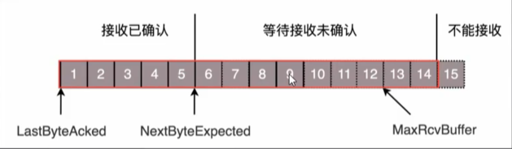

# 流量控制

## 发送端窗口

1. 在对于包的确认中，同事会携带一个窗口大小，先假设窗口不表的情况，窗口始终为9，4的确认来的时候，会右移一个，此时13就可以发送了

2. 此时假设发送端发送过猛，会将第三部分的10、11、12、13全部发送完毕，之后就停止发送了，未发送可发送部分为0

3. 当对于包5的确认到达的时候，在客户端相当于窗口再滑动一格，此时才会有更多的包可以发送，例如第14个包才可以发送

​	

## 接收方窗口

如果接收方实在处理的太慢，导致缓存中没有空间了，可以通过确认信息（ACK）修改窗口大小，甚至可以设置为0，此时发送方将暂停发送

1. 假设另一个极端情况，接收端的应用一直不读取缓存中的数据，当数据包6确认后，窗口大小就不能再是9了，要缩小一个变为8

2. 这个新的窗口8通过6的确认信息到达发送端的时候，会出现窗口没有平行右移，而是仅仅左边界右移了，窗口的大小从9变成8
3. 如果接收端还是一直不处理数据，随着确认的包越来越多，窗口越来越小直到为0

4. 当窗口通过包14的确认到达发送端的时候，发送端的窗口也会调整为0，停止发送

5. 这样发送方会定时发送窗口探测数据包，看是否有机会调整窗口大小

6. 当接收方比较慢的时候，要防止低能窗口综合征：

   只要空出一个字节来立刻告诉发送方，然后马上又填满了，可以当窗口太小的时候不更新窗口，直到达到一定大小，或者缓冲区一半为空，才更新窗口

## 报文流转

# 拥塞控制

拥塞控制的问题，也是通过**拥塞窗口cwnd**的大小来控制的，类似于水管有粗细，网络有带宽，即每秒能够发送多少数据，水管有长度，端到端有延时

理想状态下，水管里面的水的量 = 水管粗细 * 水管长度，对应到网络即**通道的容量 = 带宽 * 往返延迟**

如果设置发送窗口，使得发送但未确认的包为通道的容量，则整个网路将被塞满

如果在此基础上再调大敞口，使得单位时间内更多的包可以发送

原来发送一个包，从一端到达另一端，假设一共经过四个设备，每个设备处理一个包时间耗费1s，所以到达另一端需要耗时4s，如果发送的更加快速，则单位时间内，就会有更多的包到达这些中间设备，这些设备还是只能每秒处理一个包，多出来的包就会被**丢弃**

如果再设备上加缓存，处理不过来的在队列里面排着，这样包就不会丢失，但缺点是会增加延时，这个缓存的包4s肯定到达不了接收端，如果延时达到一定程度，就会**超时重传**

## TCP处理拥塞问题

TCP的拥塞控制主要用来避免两种现象，包丢失和超时重传。一旦出现了这些现象，说明发送速度太快了

### 慢启动（指数增长）

如果通过漏斗往瓶子里灌水，不能一桶水一下都导进去，肯定会堵住，一开始要慢慢的倒，然后越来越快，网络发包同理，在刚开始发送的时候也要控制在小流量，慢慢放开

### 拥塞控制（线性增长）

有一个阈值，当超过这个值的时候，发包速度就会放慢，避免造成拥塞

### 快速恢复（速率降级）

当接收端发现丢了一个中间包的时候，发送三次前一个包的ACK，于是发送端就会快速地重传，不必等待超时再重传，TCP认为这种情况不严重，因为大部分没丢，只丢了一小部分

## 拥塞控制状态机

