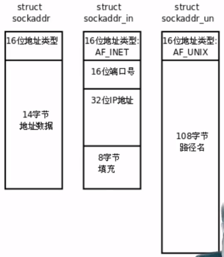

# 网络字节序

TCP/IP协议规定，**网络数据流应采用大端字节序**，即低地址高字节

为使网络程序具有可移植性，使同样的C代码在大端和小端计算机上编译后都能正常运行，可以调用以下库函数做网络字节序和主机字节序的转换

```c
#include <arpa/inet.h>
uint32_t htonl(uint32_t hostlong);
uint16_t htons(uint16_t hostshort);
uint32_t ntohl(uint32_t netlong);
uint16_t ntohs(uint16_t netshort);
```

- h: host
- n: network
- l: 32位长整形
- s: 16位短整形


# socket地址的数据类型

socket API是一层抽象的网络编程接口，适用于各种地层网络协议，如IPv4、IPv6，以及UNIX Domain Socket

但各种网络协议的地址格式不同



不同协议地址类型定义：

- IPv4: AF_INET
- IPv6: AF_INET6
- UNIX Domain Socket: AF_UNIX

这样只要取得某种sockaddr结构体的首地址，不需要指导具体是哪种类型的sockaddr结构体，就可以根据地址类型字段确定结构体中的内容

sock API的实现早于ANSI C标准化，那时候还没有void *类型，因此这些函数的参数都用struct sockaddr *类型表示，在传递参数之前需要进行强制类型转换


## TCP协议实现过程


1. 建立连接后，TCP协议提供全双工的通信服务，但是一般的客户端/服务器程序的流程是由客户端主动发起请求，服务器被动处理请求，一问一答的方式。因此服务器从accept()返回后立刻调用read()，读socket就像读管道一样，如果没有数据到达就阻塞等待
2. 此时客户端调用write()发送请求给服务器，服务器收到后从read()返回，对客户端的请求进行处理，在此期间客户端调用read()阻塞等待服务器的应答，服务器调用write()将处理结果发回给客户端，再次调用read()阻塞等待下一条请求，客户端收到后从read()返回，发送下一条请求，如此循环
3. 如果客户端没有更多的请求了，就调用close()关闭连接，就像写端关闭的管道一样，服务器的read()返回0，这样服务器就知道客户端关闭了连接，也调用close()关闭连接。注意任何一方调用close()后，连接的两个传输方向都关闭，不能再发送数据了，如果一方调用shutdown()则连接处于半关闭状态，仍可接受对方发来的数据


## 涉及到的系统调用

### socket

```c
#include <sys/types.h>
#include <sys/socket.h>
int socket(int domain, int type, int protocol);
```

- domain: 指定对应哪个域
  - AF_INET: IPv4
  - AF_INET6: IPv6

- type: 指定传输模式
  - SOCK_STREAM: 流文件形式传输
  - 也可以通过按位或的形式挂载其他属性，例如：SOCK_NONBLOCK指定非阻塞传输
- protocol: 指定另外一个传输协议，一般为0

- 返回值：调用socket函数可以返回一个socket套接字，即一个用于数据传输的文件描述符，此为网络传输的句柄

### bind

```c
#include <sys/types.h>
#include <sys/socket.h>
int bind(int sockfd, const struct sockaddr *addr, socklen_t addrlen);
```

bind的作用是将一个套接字结构体指针绑定在一个套接字文件描述符上

- sockfd: 由socket()函数得到的套接字文件描述符
- addr: 网络套接字格式结构体指针
- addrlen: 指出套接字结构体长度（byte）

- 返回值: 成功返回0，失败返回-1，并设置errno

### listen

```c
#include <sys/types.h>
#include <sys/socket.h>
int listen(int sockfd, int backlog);
```

listen用于监听某个套接字端口

- sockfd: 要监听的套接字文件描述符
- backlog：指定多用户访问的排队队列大小

- 返回值：成功返回0，失败返回-1，并设置errno

### accept

```c
#include <sys/types.h>
#include <sys/socket.h>
int accept(int sockfd, struct sockaddr *addr, socklen_t *addrlen);
```

表示接受连接，调用后可以生成用于通信的套接字文件描述符，服务器可以利用这个描述符作为信息传递的句柄

- sockfd: 传入用于监听的套接字
- addr: 用于存放传入的先头套接字地址
- addrlen：用于指定套接字结构体长度（值结果参数：必须指定，返回时会传出）

- 返回值：成功时返回连接好的套接字

### connect

```c
#include <sys/types.h>
#include <sys/socket.h>
int connect(int sockfd, const struct sockaddr *addr, socklen_t addrlen);
```

connect 用于客户端将本地的套接字地址和通信套接字描述符进行连接

- sockfd：客户端调用socket函数获得的套接字描述符，后续用于读写
- addr：用于存储连接到的服务器地址
- addrlen：用于指定sockaddr结构体大小

- 返回值：成功返回0，失败返回-1

