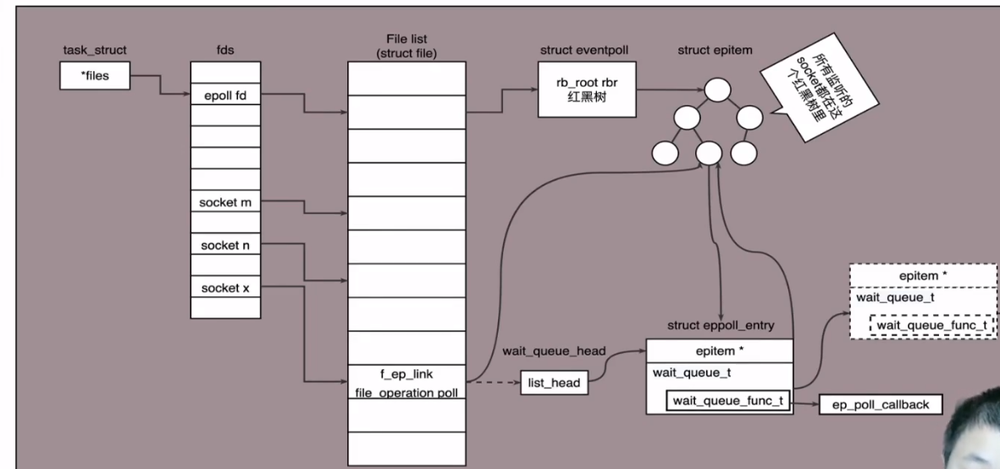

# epoll模型

线程池方法实现的TCP架构仍然存在局限性，比如线程池最多支持10个线程，那么当第11个客户端请求服务的时候就会阻塞在任务队列中，必须要等到前面10个客户端有至少一个断开连接才能空出一个线程供第11个客户端连接

为了解决这个问题，引入epoll + 线程池并法的方式实现高并法访问




## epoll原理

epoll通过注册callback函数的方式，当**某个文件描述符发送变化**的时候，就会主动通知，即只有接收到客户端发送数据的时候线程才会对接，如果连接上的客户端处于standby状态，则线程会被释放做别的服务，即**线程池服务的不是客户端本身而是客户端的一次请求**

参考：https://www.cnblogs.com/Hijack-you/p/13057792.html


## epoll相关系统调用

### epoll event数据结构

```c
typedef union epoll_data {
    void *ptr;
    int fd;
    uint32_t u32;
    uint64_t u64;
} epoll_data_t;

struct epoll_event {
    uint32_t events; //Epoll events
    epoll_data_t data; //user data variable
}
```

epoll events 按位存储，可以通过按位或实现多种event监听

- EPOLLIN: 相关文件能否进行读操作
- EPOLLOUT: 相关文件能否进行写操作
- EPOLLRDHUP: socket中断连接
- EPOLLPRI: 关联的文件描述符有其他情况
- EPOLLERR: 关联的文件描述符有报错
- EPOLLHUP: 关联的文件描述符被挂起
- EPOLLET: 为关联的文件描述符设置上升沿（或下降沿）触发
- EPOLLONESHOT: 将关联的文件描述符设置为一次性触发
- EPOLLWAKEUP: 唤醒
- EPOLLEXCLUSIVE: 设置专属wakeup服务

### 创建epoll

```c
#include <sys/epoll.h>
int epoll_create(int size);
```

- size: 表示可同时监听多少个事件
- 返回值：epoll文件描述符（epoll的句柄）

### 设置监听event

```c
#include <sys/epoll.h>
int epoll_ctl(int epfd, int op, int fd, struct epoll_event *event);
```

- epfd: epoll文件描述符
- op: 操作类型
  - EPOLL_CTL_ADD: 向监听集合中添加event
  - EPOLL_CTL_MOD: 修改监听集合中的event
  - EPOLL_CTL_DEL: 删除监听集合中的event

- 返回值：成功返回0，失败返回-1，并设置errno

### 等待事件

```c
#include <sys/eopll.h>
int epoll_wait(int epfd, sturct epoll_event *events, int maxevents, int timeout);
```

- epfd: epoll文件描述符
- events: epoll监听事件
- maxevents: 最多等待事件数量
- timeout: 等待事件的阻塞时间，设置为-1将一直阻塞等待
- 返回值: 成功返回可用于I/O的文件描述符个数，失败返回-1，并设置errno


## epoll模型代码演示

### 服务器端代码

```c
#include<stdio.h>
#include <sys/types.h>
#include <sys/socket.h>
#include <netinet/in.h>
#include <netinet/ip.h>
#include <strings.h>
#include <unistd.h>
#include <ctype.h>
#include <arpa/inet.h>
#include <stdlib.h>
#include <string.h>
#include <sys/wait.h>
#include <pthread.h>
#include <sys/epoll.h>

#define SERV_PORT 8000
#define MAXLINE 80
#define EPOLL_SIZE 256

#define prrexit(msg) {\
    perror(msg);\
    exit(1);\
}

//构建任务队列
typedef struct Task {
    int fd;
    struct Task *next;
} Task;

typedef struct TaskPool {
    Task *head;
    Task *tail;
    pthread_mutex_t lock; //多线程锁
    pthread_cond_t havetask; //多线程条件
} TaskPool;

//初始化任务队列
TaskPool *task_pool_init() {
    TaskPool *tp = (TaskPool *) malloc(sizeof(TaskPool));
    tp -> head = NULL;
    tp -> tail = NULL;
    pthread_mutex_init(&(tp -> lock), NULL);
    pthread_cond_init(&(tp -> havetask), NULL);
    return tp;
}

//队列push（尾插法）
void task_pool_push(TaskPool *tp, int fd) {
    pthread_mutex_lock(&tp -> lock);
    Task *t = (Task *) malloc(sizeof(Task)); 
    t -> fd = fd;
    t -> next = NULL;
    if (!tp -> tail) {
        tp -> head = tp -> tail = t;
    } else {
        tp -> tail -> next = t;
        tp -> tail = t;
    }
    pthread_cond_broadcast(&tp -> havetask);
    pthread_mutex_unlock(&tp -> lock);
}

//队列pop（头删法）
Task task_pool_pop(TaskPool *tp) {
    pthread_mutex_lock(&tp -> lock);
    //队列中有节点才能pop
    while (!tp -> head) {
        pthread_cond_wait(&tp -> havetask, &tp -> lock);
    }

    Task tmp, *k;
    k = tp -> head;
    tmp = *k;
    tp -> head = tp -> head -> next;
    if (!(tp -> head)) tp -> tail = NULL;
    free(k);
    pthread_mutex_unlock(&tp -> lock);
    return tmp;
}

//释放任务队列
void task_pool_free(TaskPool *tp) {
    pthread_mutex_lock(&tp -> lock);
    Task *p, *k;
    p = tp -> head;
    while (p) {
        k = p;
        p = p -> next;
        free(k);
    }
    pthread_mutex_unlock(&tp -> lock);
    pthread_cond_destroy(&tp -> havetask);
    pthread_mutex_destroy(&tp -> lock);
    free(tp);
}

//子线程操作函数
void *up_server(void *arg) {
    pthread_detach(pthread_self()); //将子线程切换到detach状态，当线程结束时自动归还资源
    char buf[MAXLINE];
    int n;
    TaskPool *tp = arg;

    while (1) { //循环获取任务
        Task tmp = task_pool_pop(tp);
        int connfd = tmp.fd;
        printf("get task fd = %d\n", connfd);
        n = read(connfd, buf, MAXLINE); //读取客户端输入并进行处理
        write(1, buf, n);
        for (int i = 0; i < n; ++i) {
            buf[i] = toupper(buf[i]);
        }
        write(connfd, buf, n);
        printf("task %d finished\n", connfd);
        if (!strncmp(buf, "QUIT", 4)) {
            //客户端已断开连接
            close(connfd);
        }
    }

    return (void *) 0;
}

int main() {

    int listenfd, connfd;
    struct sockaddr_in serveraddr, cliaddr;
    socklen_t cliaddr_len;
    char str[INET_ADDRSTRLEN]; //用于存储IP地址字符串
    int n;

    //初始化线程池队列
    TaskPool *tp = task_pool_init();

    //创建多线程,等待任务
    pthread_t tid;
    for (int i = 0; i < 4; ++i) {
        pthread_create(&tid, NULL, up_server, (void *) tp);
        printf("new thread is %#lx\n", tid);
    }

    //主线程工作 
    //生成一个监听套接字描述符
    listenfd = socket(AF_INET, SOCK_STREAM, 0);
    if (listenfd < 0) prrexit("socket");

    //创建epoll
    int epfd = epoll_create(EPOLL_SIZE);
    struct epoll_event ev, events[EPOLL_SIZE]; //epoll事件结构体
    ev.events = EPOLLIN | EPOLLET; //监听读入和状态变化
    ev.data.fd = listenfd; //设置监听的文件描述符
    epoll_ctl(epfd, EPOLL_CTL_ADD, listenfd, &ev); //创建监听

    //服务器ip地址及端口初始化
    bzero(&serveraddr, sizeof(serveraddr)); //清空内存区域
    serveraddr.sin_family = AF_INET; //IPv4协议组
    serveraddr.sin_port = htons(SERV_PORT); //端口，需要转换为网络字节序
    serveraddr.sin_addr.s_addr = htonl(INADDR_ANY); //指定任意IP，即所有IP都可以，需要转化为网络字节序

    //绑定监听套接字描述符到源IP的对应端口
    if (bind(listenfd, (struct sockaddr *)&serveraddr, sizeof(serveraddr)) < 0) prrexit("bind");

    //设置监听
    if (listen(listenfd, 2) < 0) prrexit("listen");
    printf("Accepting connections...\n");
    while (1) {
        int nfds = epoll_wait(epfd, events, EPOLL_SIZE, -1); //设置阻塞等待
        for (int i = 0; i < nfds; ++i) {
            if (events[i].data.fd == listenfd) {
                //新的客户端连接
                cliaddr_len = sizeof(cliaddr);
                connfd = accept(listenfd, (struct sockaddr *) &cliaddr, &cliaddr_len);
                if (connfd < 0) prrexit("accept");
                printf("package received from %s:%d\n", \
                       inet_ntop(AF_INET, &cliaddr.sin_addr, str, sizeof(str)), \
                       ntohs(cliaddr.sin_port));
                //将新连接的客户端加入监听集合
                ev.events = EPOLLIN | EPOLLET;
                ev.data.fd = connfd;
                epoll_ctl(epfd, EPOLL_CTL_ADD, connfd, &ev);
            } else if (events[i].events & EPOLLIN) {
                //已连接客户端发来数据
                int clifd = events[i].data.fd;
                if (clifd < 3) continue; //排除标准输入、标准输出、标准错误输出
                task_pool_push(tp, clifd);
            }
        }

    }

    task_pool_free(tp);

    return 0;
}
```

### 客户端代码

```c
#include<stdio.h>
#include <sys/types.h>
#include <sys/socket.h>
#include <netinet/in.h>
#include <netinet/ip.h>
#include <strings.h>
#include <string.h>
#include <unistd.h>
#include <ctype.h>
#include <arpa/inet.h>

#define SERV_PORT 8000
#define MAXLINE 80

int main() {
    int sockfd = socket(AF_INET, SOCK_STREAM, 0);
    int n;
    struct sockaddr_in serveraddr;
    char buf[MAXLINE] = {"hello tcp"};

    //服务器ip地址及端口初始化
    bzero(&serveraddr, sizeof(serveraddr)); //清空内存区域
    serveraddr.sin_family = AF_INET; //IPv4协议组
    serveraddr.sin_port = htons(SERV_PORT); //端口，需要转换为网络字节序
    inet_pton(AF_INET, "127.0.0.1", &serveraddr.sin_addr);
    connect(sockfd,(struct sockaddr *) &serveraddr, sizeof(serveraddr));

    while (n = read(0, buf, MAXLINE)) {
        write(sockfd,buf, n);
        if (!strncmp(buf, "quit", 4)) break;
        n = read(sockfd, buf, MAXLINE);
        printf("response from server:\n");
        write(1, buf, n);
    }
    close(sockfd);
    return 0;
}
```

