# 红黑树的特性

## 五个条件

1. 每个节点非黑即红
2. 根节点是黑色
3. 叶节点（NIL）是黑色
4. 如果一个节点是红色，则它的两个子节点都是黑色
5. 从根节点出发到所有叶节点路径上，黑色节点数量相同


## 平衡条件的认识

- 条件4和5决定了，红黑树中最长路径是最短路径的长度的2倍

- 本质上红黑树也是通过树高来控制平衡的

- 红黑树比AVL树的树高控制条件更松散，红黑树在发生节点插入和删除以后，发生调整的概率比AVL树小


## 调整策略

1. 插入调整站在**祖父节点**向下看
2. 删除调整站在**父节点**向下看
3. 插入和删除的情况处理一共5种
4. 把每一种情况都想象成一颗大的红黑树中的局部子树

5. <u>**调整原则：对局部子树来说，调整前每条路径上黑色节点数量 == 调整后每条路径上黑色节点数量**</u>


# 插入调整的情况

如果插入的是黑色节点，由于它一定会改变某一条路径上黑色节点的数量，所以插入黑色节点必然需要调整

如果插入的是红色节点，如果它插到一个黑色节点下面，就不需要调整，只有当两个红色节点连在一起的时候才需要调整

所以新插入的节点一定是红色，而插入调整主要就是解决双红的情况


## 情况一

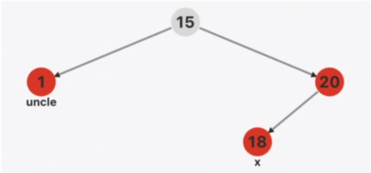

一个黑色节点下有两个红色子节点，再将一个红色节点插入到某个红色子节点下方的情况

在红色节点20下面插入一个新的红色节点18,需要调整

由调整策略1可知，对节点18的调整是通过它的祖父节点15操作的

处理办法：1和20修改成黑色，15修改成红色（所谓的红色上顶）


## 情况二

### L-L失衡

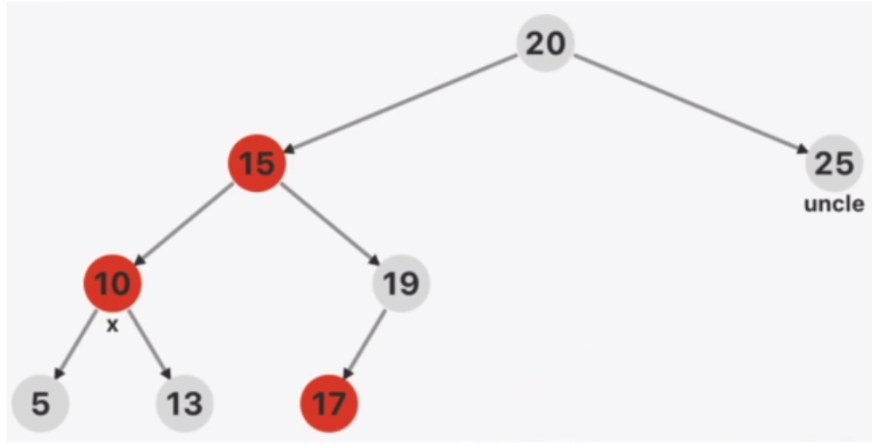

站在祖父节点向下看，双红发生在父节点和当前节点，同时叔叔节点是黑色，参考AVL树的失衡情况，分成L-L, L-R, R-L, R-R四种情况，先进行旋转调整策略，然后再修改三元组的颜色

- 如果冲突发生在左子树，且左子树的左子节点是红色，就是L-L失衡，需要进行右旋

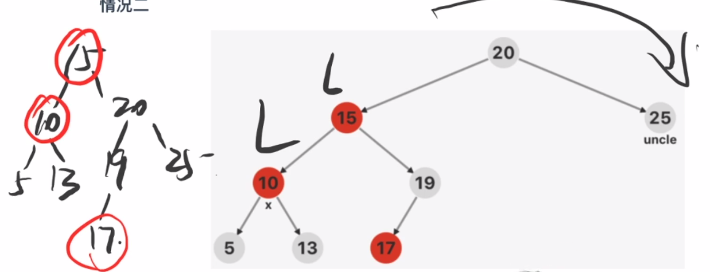

- 处理办法：大右（左）旋，此时每条路径需要有两个黑色节点，有两种调整方法
  - 20调整成红色，15调整成黑色（红色下沉）
  - 10 调整成黑色（红色上浮）

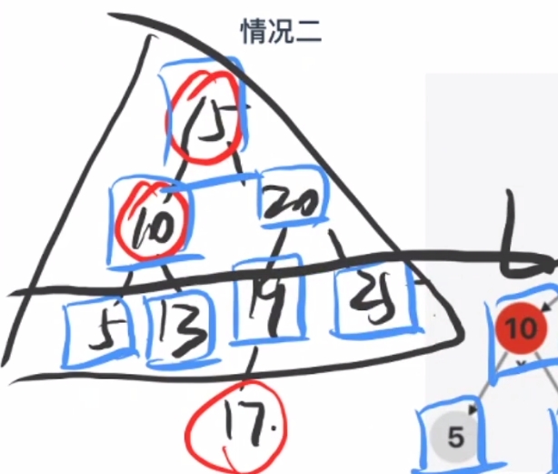

### L-R失衡

对于L-R失衡的情况，只需要先对冲突的两个节点进行小左旋，变为L-L失衡，然后在参照L-L失衡的情况进行大右旋，再调整即可

### R-R失衡

类似L-L处理方式，先进行大左旋，然后调整上部颜色

### R-L失衡

类似L-R处理方式，先对冲突的两个红色节点进行小右旋，使其变为R-R失衡，然后参照R-R失衡的情况进行调整

 


# 删除调整

## 删除调整发生的前提

1. 删除红色节点，不会对整个红黑树的平衡造成影响，所以删除调整是建立在删除黑色节点的基础上的
2. 黑色节点按照度划分为0,1,2三种情况，度为2的情况可以转换为度为0,1的情况
3. 删除度为1的黑色节点：由于它的度为1,那么基于红黑树的性质，它的唯一子节点一定是红色的，删除前每条路径上黑色节点的数量是1,为了保证调整前后每条路径上黑色节点数量不变，在删除这个黑色节点的时候需要将它的唯一子节点替换到它的位置上并且变为黑色
4. 删除度为0的黑色节点：度为0的黑色节点下挂着两个NIL节点，由于NIL节点是黑色的，所以算上NIL节点，删除前每条路径上黑色节点的数量是2，那么删除这个黑色节点后，它的位置也将被一个NIL节点取代，为了保证调整前后每条路径上黑色节点数量不变，所以这个黑色节点删除后，取代它的NIL节点会被标记为double black，即计算两次黑色
5. 删除调整主要为了解决双重黑色的情况


## 情况一

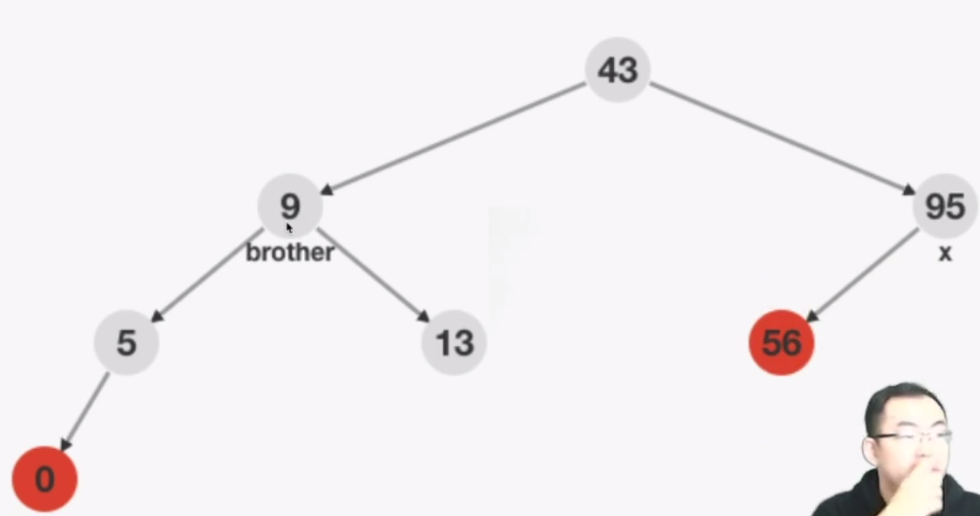

双重黑x的兄弟节点是黑色，并且兄弟节点的两个子节点也是黑色

处理办法：将双重黑节点减去一层黑色，并且将它的兄弟节点也减去一层黑色，将它的父节点加一重黑色，变为双重黑（双重黑向上传递）


## 情况二（L-R，R-L）

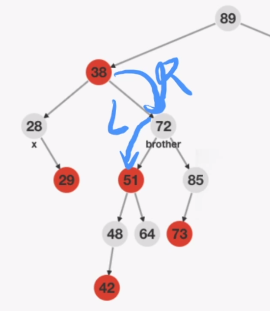

- 双重黑x的兄弟节点是黑色
- 双重黑x的兄弟节点的右子树是黑色，左子树是红色
- 从x的父节点向下看，构成了R-L失衡

处理方法：对R-L失衡部分进行小右（左）旋，基于调整原则，需要将51变成黑色，72变成红色，从x的父节点看就转变成了R-R失衡，使用情况三统一处理

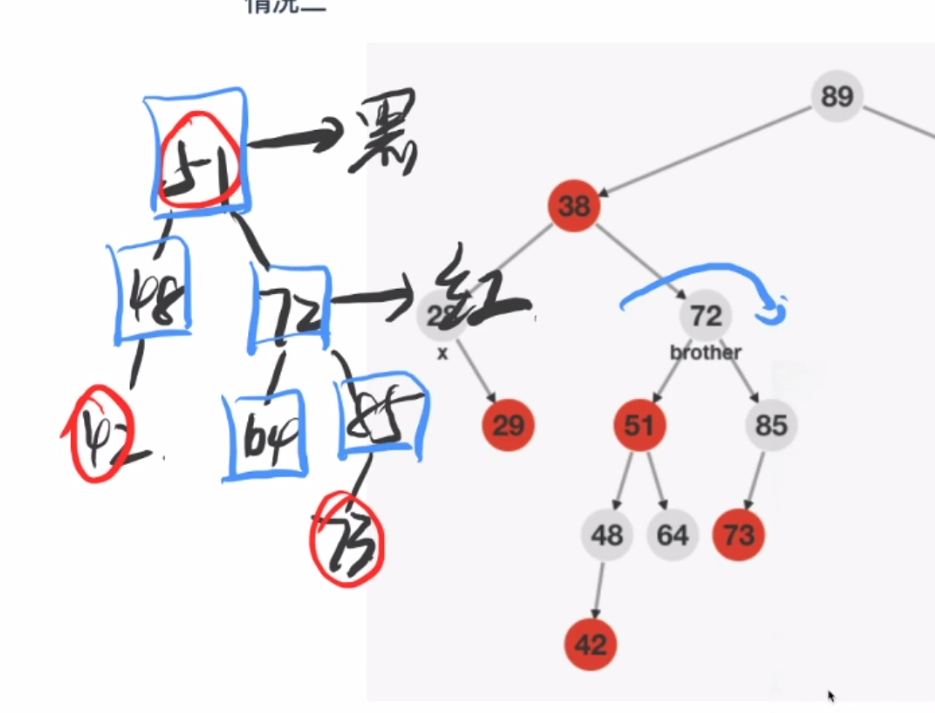


## 情况三（R-R，L-L）

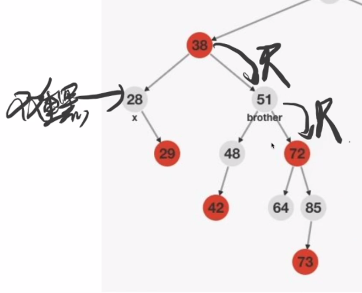

- 双重黑节点x的兄弟节点是黑色
- 双重黑节点有一个红色子节点
- 双重黑节点x的黑色兄弟节点的相同侧也是一个红色节点
- 从x的父节点向下看，构成了R-R失衡的情况

处理方法：对R-R失衡部分进行大左（右）旋，由于48号节点的颜色不确定，它可能是红色，所以为了不发生冲突，将38的颜色改成黑色，为了保证调整原则，将51改成原有根节点的颜色，将72改成黑色，这样一定不会发生冲突

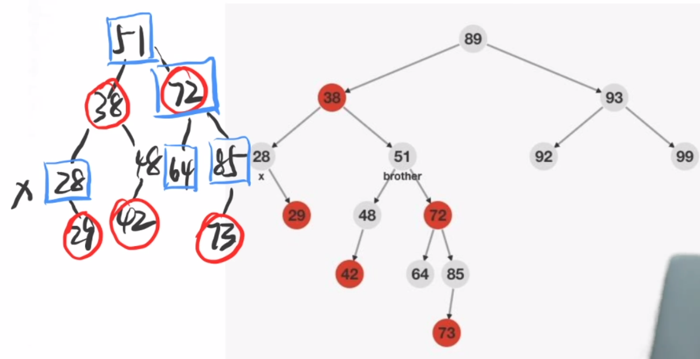

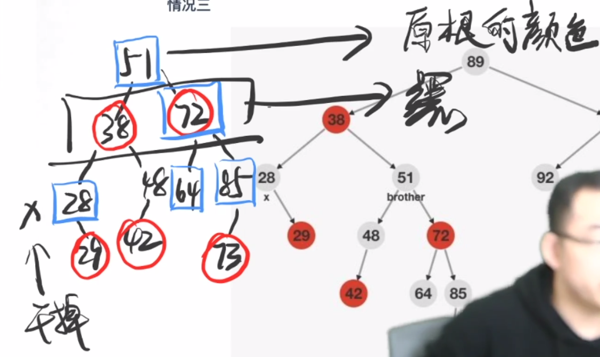


## 情况四

如果双重黑x的兄弟节点是红色，就通过旋转，将其调整成兄弟节点是黑色的情况，再套用方法1,2,3解决

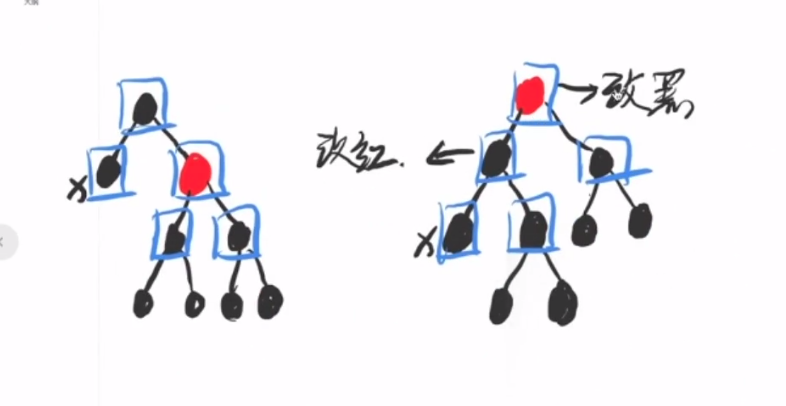


# 代码演示

- 插入调整发生在递归的回溯阶段

- 插入调整代码中，使用goto语句，将8行代码合并成4行

- 处理根节点一定是黑色，通过代码封装

  ```c
  insert() -> __insert()
  erase() -> __erase()
  ```

```c
#include<stdio.h>
#include <stdlib.h>

typedef struct Node {
    int key;
    int color; // 0-red, 1-black, 2-double black
    struct Node *lchild, *rchild;
} Node;

//构建虚拟叶子节点
Node __NIL;
#define NIL (&__NIL)
__attribute__((constructor))
void init_NIL() {
    NIL -> key = 0;
    NIL -> color = 1;
    NIL -> lchild = NIL -> rchild = NIL;
    return;
}

//创建新节点
Node *getNewNode(int key) {
    Node *p = (Node *) malloc(sizeof(Node));
    p -> key = key;
    p -> color = 0;
    p -> lchild = p -> rchild = NIL;
    return p;
}

//判断一个根节点下方是否有红色的子孩子节点
int has_red_child(Node *root) {
    return root -> lchild -> color == 0 || root -> rchild -> color == 0;
}

//左旋
Node *left_rotate(Node *root) {
    Node *temp = root -> rchild;
    root -> rchild = temp -> lchild;
    temp -> lchild = root;
    return temp;
}

//右旋
Node *right_rotate(Node *root) {
    Node *temp = root -> lchild;
    root -> lchild = temp -> rchild;
    temp -> rchild = root;
    return temp;
}

//插入调整：解决双红的情况
Node *insert_maintian(Node *root) {
    int flag = 0; //表征冲突发生的地方
    if (!has_red_child(root)) return root; //root下面没有红色节点，无需调整
    if (root -> lchild -> color == 0 && root -> rchild -> color == 0) {
        //情况一：一个节点的左右子节点都是红色，调整为红黑黑的情况
        goto insert_end;
    }
    if (root -> lchild -> color == 0 && has_red_child(root -> lchild)) flag = 1;
    if (root -> rchild -> color == 0 && has_red_child(root -> rchild)) flag = 2;
    if (flag == 0) return root; //没有发生冲突
    if (flag == 1) { //L:左子树冲突
        if (root -> lchild -> rchild -> color == 0) {
            //L-R失衡情况，先小左旋
            root -> lchild = left_rotate(root -> lchild);
        }
        //L-L失衡，大右旋
        root = right_rotate(root);
    } else { //R:右子树冲突
        if (root -> rchild -> lchild -> color == 0) {
            //R-L失衡情况，先小右旋
            root -> rchild = right_rotate(root -> rchild);
        }
        //R-R失衡，大左旋
        root = left_rotate(root);
    }
insert_end:
    //调整颜色，红色上浮
    root -> color = 0;
    root -> lchild -> color = root -> rchild -> color = 1;
    return root;
}

//插入新节点
Node *__insert(Node *root, int key) {
    if (root == NIL) return getNewNode(key);
    if (root -> key == key) return root;
    if (key < root -> key) {
        root -> lchild = __insert(root -> lchild, key);
    } else {
        root -> rchild = __insert(root -> rchild , key);
    }
    return insert_maintian(root);
}

//封装一层，用于改变根节点的颜色
Node *insert(Node *root, int key) {
    root = __insert(root, key);
    root -> color = 1;
    return root;
}

//寻找前驱节点
Node *predecessor(Node *root) {
    Node *temp = root -> lchild;
    while (temp -> rchild != NIL) temp = temp -> rchild;
    return temp;
}

//删除调整
Node *erase_maintain(Node *root) {
    //没有双重黑的情况，无需调整，直接返回
    if (root -> lchild -> color != 2 && root -> rchild -> color != 2) return root;
    if (has_red_child(root)) {
        //兄弟节点是红色的情况，通过小旋转调整为兄弟节点是黑色的情况
        int flag = 0;
        root -> color = 0; //原根设置为红色
        if (root -> lchild -> color == 0) {
            root = right_rotate(root); flag = 1;
        } else {
            root = left_rotate(root); flag = 2;
        }
        root -> color = 1; //新根设置为黑色
        if (flag == 1) root -> rchild = erase_maintain(root -> rchild);
        else root -> lchild = erase_maintain(root -> lchild);
        return root;
    }
    //情况一：兄弟节点是黑色，且其下没有红色节点
    if ((root -> lchild -> color == 2 && !has_red_child(root -> rchild)) || 
        (root -> rchild -> color == 2 && !has_red_child(root -> lchild))) {
            root -> lchild -> color -= 1;
            root -> rchild -> color -= 1;
            root -> color += 1;
            return root;
    }
    //情况二三：兄弟节点是黑色，且其下有红色节点
    if (root -> lchild -> color == 2) {
        if (root -> rchild -> rchild -> color != 0) {
            //情况二：兄弟节点的右子树不是红色，需要小右旋
            root -> rchild -> color = 0;
            root -> rchild = right_rotate(root -> rchild);
            root -> rchild -> color = 1;
        }
        //情况三：兄弟节点的右子树是红色，需要大左旋
        root = left_rotate(root);
        root -> color = root -> lchild -> color;
    } else {
        if (root -> lchild -> lchild -> color != 0) {
            //情况二：兄弟节点的左子树不是红色，需要小左旋
            root -> lchild -> color = 0;
            root -> lchild = left_rotate(root -> lchild);
            root -> lchild -> color = 1;
        }
        //情况三：兄弟节点的左子树是红色，需要大右旋
        root = right_rotate(root);
        root -> color = root -> rchild -> color;
    }
    root -> lchild -> color = root -> rchild -> color = 1;
    return root;
}

//删除节点
Node *__erase(Node *root, int key) {
    if (root == NIL) return NIL;
    //二分法找到要删除的那个节点
    if (key < root -> key) {
        root -> lchild = __erase(root -> lchild , key);
    } else if (key > root -> key) {
        root -> rchild = __erase(root -> rchild , key);
    } else { //当前节点
        if (root -> lchild == NIL || root -> rchild  == NIL) {
            //度为0或1的情况
            Node *temp = root -> lchild != NIL ? root -> lchild : root -> rchild ;
            temp -> color += root -> color;
            free(root);
            return temp;
        } else {
            //度为2的情况
            Node *temp = predecessor(root);
            root -> key = temp -> key;
            root -> lchild = __erase(root -> lchild, temp -> key);
        }
    }
    return erase_maintain(root);
}

//封装一层，将根节点变成黑色
Node *erase(Node *root, int key) {
    root = __erase(root, key);
    root -> color = 1;
    return root;
}

//释放红黑树
void clear(Node *root) {
    if (root = NIL) return;
    clear(root -> lchild);
    clear(root -> rchild);
    free(root);
    return;
}

void print(Node *root) {
    printf("(%d| %d, %d, %d)\n",
          root -> color,
          root -> key, 
          root -> lchild -> key,
          root -> rchild -> key
    );
    return;
}

//前序遍历
void output(Node *root) {
    if (root == NIL) return;
    print(root);
    output(root -> lchild);
    output(root -> rchild);
    return;
}

int main() {
    int op, val;
    Node *root = NIL;
    while (~scanf("%d%d", &op, &val)) {
        switch (op) {
            case 1: root = insert(root, val); break; 
            case 2: root = erase(root, val); break;
        }
        output(root);
        printf("------------------\n");
    }

    return 0;
}
```

